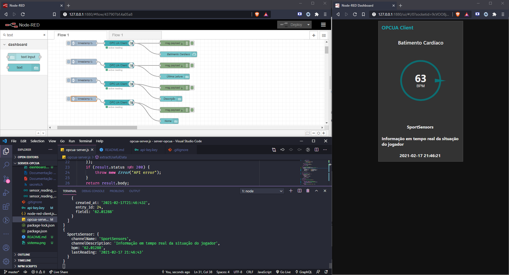
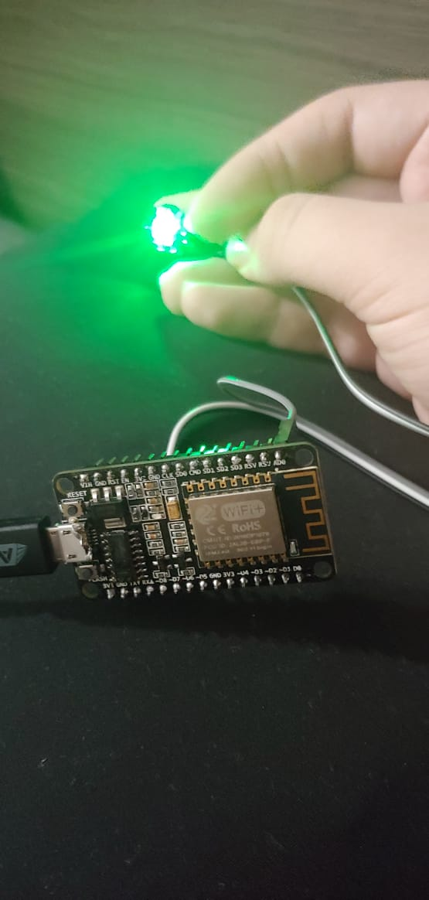

## :file_folder: The Project
Project developed during Mechatronics Engineering course for Distributed Systems subject. The main goal of the **Node OPCUA Server/Client** project is to implement OPCUA communication. To do so we've built a server using [node-opcua](https://github.com/node-opcua/node-opcua) library.
As a source of data we've built a simple hardware solution using ESP8266 and a pulse sensor. These data were sent to [Thingspeak](https://thingspeak.com/), accessed through its API using the unirest* library and then presented by OPCUA server.

*The unirest library uses the request module on its implement which is deprecated but it still works in this case. It's recommended to replace unirest with axios if you want to work with a library that still have support.

## :rocket: Technologies
|Data source       |OPCUA server   |   Web client    |
|[ESP8266](https://www.espressif.com/sites/default/files/documentation/0a-esp8266ex_datasheet_en.pdf)           | :---:         |     :---:       |
|[Pulse sensor](https://github.com/WorldFamousElectronics/PulseSensorPlayground) | Node.js       | Javascript      |
|[ThingspeakIoT](https://thingspeak.com/)        | node-opcua    | Node-red        |
|                  | unirest       |                 |

## :clipboard: Firmware explanation
  ### Pulse sensor
  The optic sensor sends a signal from 0 to 1024 that is proportional to the observed in the user's blood. This reading is made every 0,1s and from that is inferred if heart is in diastole or systole process. From getting the time between 2 systoles is possible to determine the interval of a heart beat. From the average value of these intervals is calculated the heart frequency in BPM with a 200 reading cycles sample.

  ### ESP8266 -> ThingSpeak API Connection
  ESP8266 connects to internet via WiFi and sends the acquired data to ThingSpeak platform via HTTP. ThingSpeak collects the BPM data every 20s and provide it via API which is requested by OPCUA Server.

  ### OPCUA Server/Client application
  The OPCUA Server retrieves data from ThingSpeak API by making a get request to it and then the data values can be accessesd by a client. The client can access the variables by browsing its name or by variable's nodeId. As the library used allows to create a custom nodeId we decided to access the variable using it.
  The client was made using Node-Red with a [OPCUA](https://flows.nodered.org/node/node-red-contrib-opcua) library and just shows to user the BPM retrieved from server.

![## :camera: Project:]



## :computer: Installation
### Running the **OPCUA Server**:
Clone this repository with 
```bash
git clone https://github.com/gustavocioccari/server-opcua-sd.git ARRUMAR LINK
```
Then run the following commands:
```bash
cd opcua-implementation
npm i
node 
```
You'll have to change the "BASE_URL" and "params" consts to any other API you want to use.
___
### Running the **Web client**:
You'll need [Node Red](https://nodered.org/docs/getting-started/local) installed and install the [node-red-contrib-opcua](https://flows.nodered.org/node/node-red-contrib-opcua) package to run the client
Then run Node Red with the command
```bash
node-red
```
The web project will start running on `http://127.0.0.1:1880/`.
You can import the node red flow available on the repo and deploy it. After the deploy you can access `http://127.0.0.1:1880/ui` to see the client.
